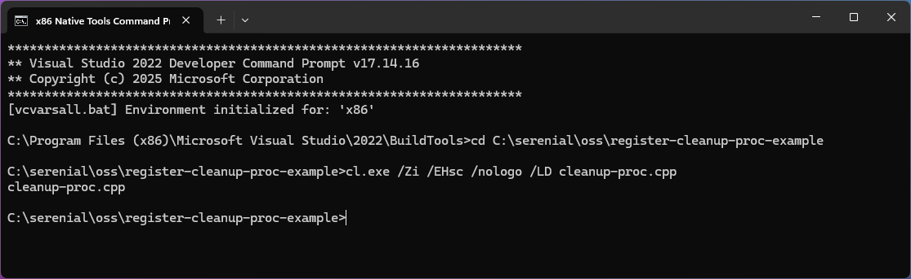
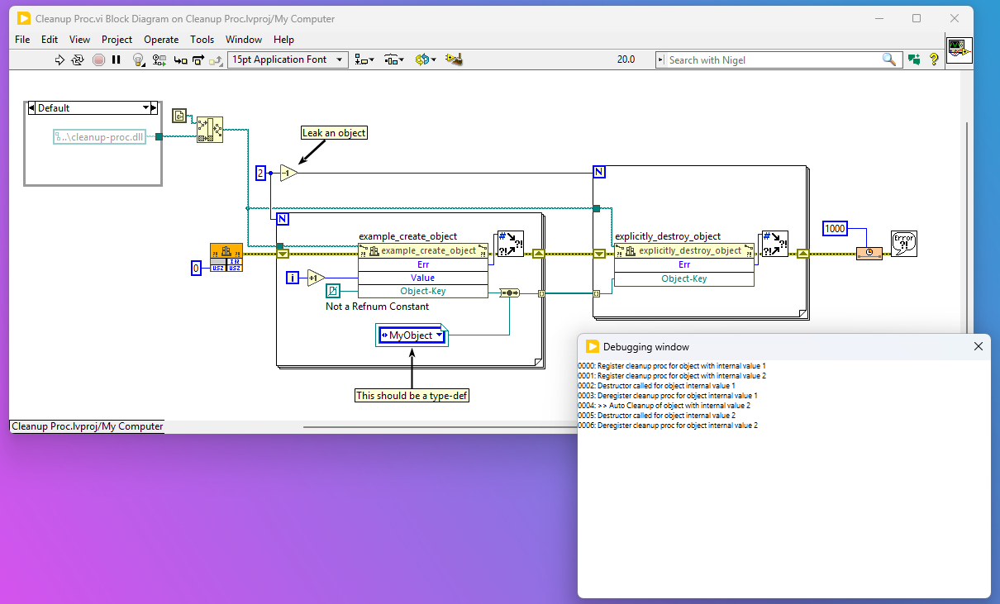

# LabVIEW Cleanup Proc Minimal C++ Example

This is a 190 line self contained example of how to use the under documented `CleanupProc` in C++ with LabVIEW on Windows.

Its is based on https://github.com/ni/grpc-labview/blob/51c1ef2dbeb9f20ca8e8d19bfa0420c385280a25/src/lv_interop.cc#L20

The code imports the `RTSetCleanupProc` function exported by the LabVIEW IDE/Runtime so it can be compiled without any linkage to ni provided binaries.

The code is only written for compilation on windows with MSVC. If you want a more complete example of cross-platform then see https://gitlab.com/serenial/basler-camera-toolkit-for-labview

The code also show using data log references as handles. Note, because refnums are only 32-bit in size we need to implement a global lookup between refnums and object pointers to support 64-bit usage. I would probably just use raw pointer sized integers and wrap them in an LVClass.

# Building 

Binaries are provided but should you with to modify them then launch the MSVC developer prompt with the bitness you need (x86 or x64) and use the following

```powershell
cd <directory of this repo>
cl.exe /Zi /EHsc /nologo /LD cleanup-proc.cpp
```



# Usage

Open the LabVIEW project (files saved as LV 2020) and run the code

